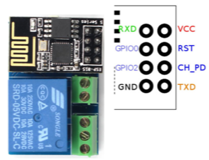
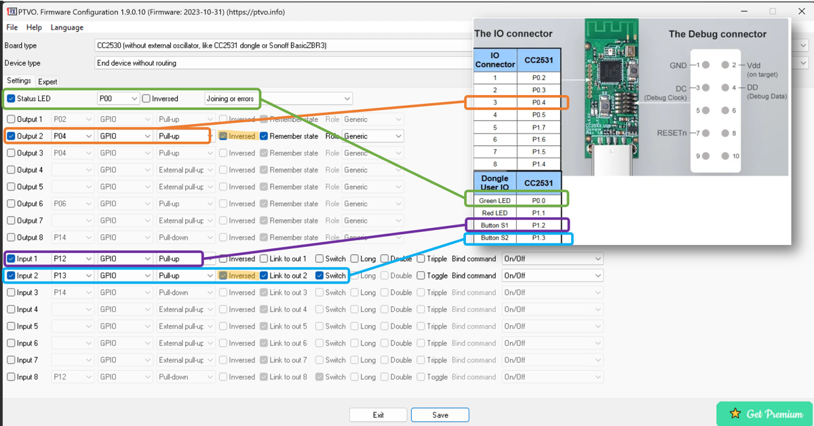

# Manage one way relay module with CC2531 and PTVO firmware
How to control the one way relay module using CC2531 zigbee usb stick instead of the ESP01 module coming with the relay.

## Relay module pinout

The relay control i connected to GPIO0
* Relay OFF -> GPIO0=high
* Relay ON  -> GPIO0=low




## CC2531 Firmware Configuration
Firmware from https://ptvo.info/ 

* The P04 pin of the chip is connected to pin 3 of the IO connector
* Green led is the status led
* Input 1, defined as switch, allows device reset. It is connected to S1
* Input 2 is controlling by output to which the relay is toggled. It is connected to S2
* The relay is activated by LOW state. The inverse toggle of the input & output, ensures that HIGH state on the input is relay's OFF



## MQTT commands
```
 mosquitto_pub -h <broker> -t zigbee2mqtt/<friendly name>/set -m '{"state_l2": "ON"}'
 mosquitto_pub -h <broker> -t zigbee2mqtt/<friendly name>/set -m '{"state_l2": "OFF"}'
 mosquitto_pub -h <broker> -t zigbee2mqtt/<friendly name>/set -m '{"state_l2": "TOGGLE"}'
 
 mosquitto_sub -h <broker> -t zigbee2mqtt/<friendly name>/state_l2
```
state_l2 corresponds to the input 2 as configured in the cc2531 firmware
